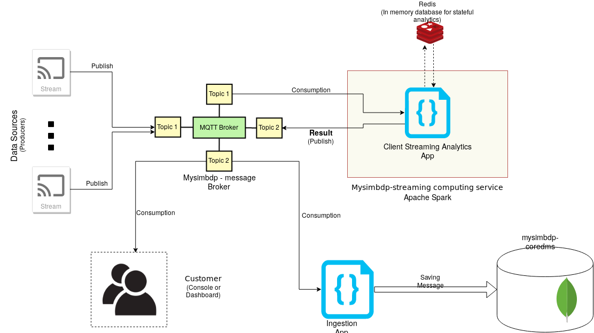
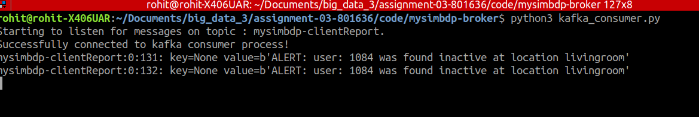
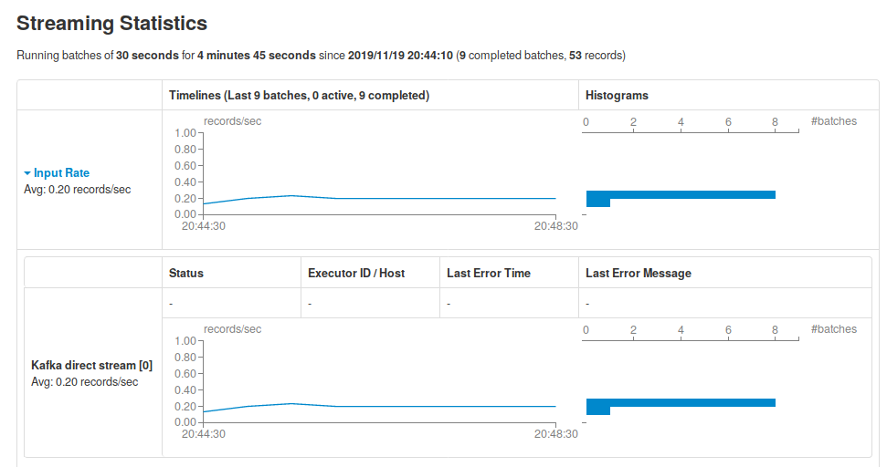
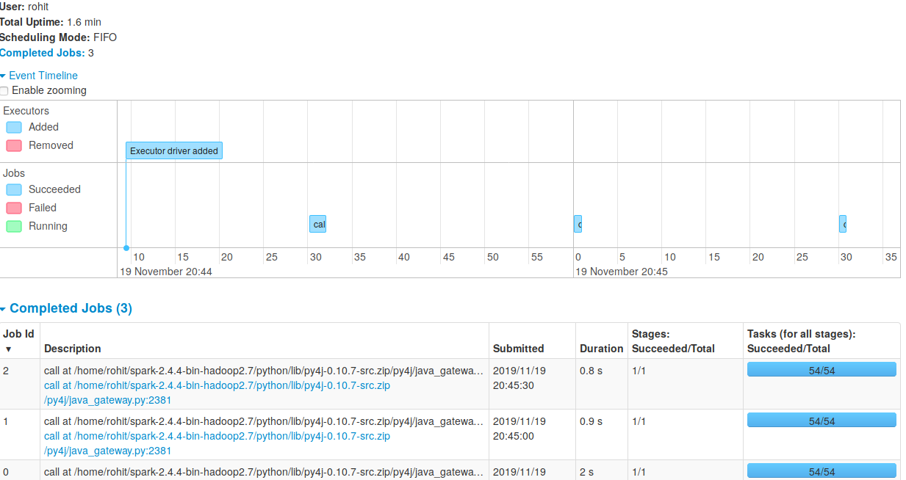
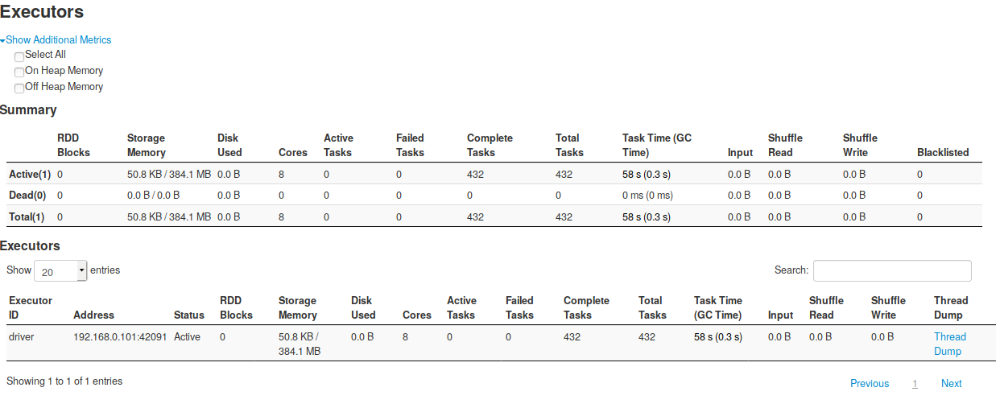
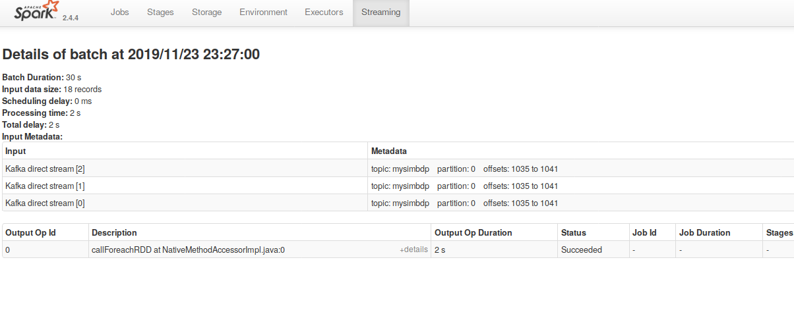
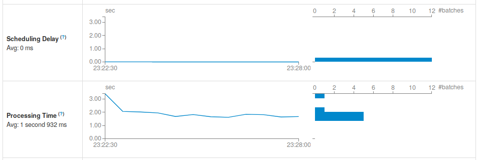
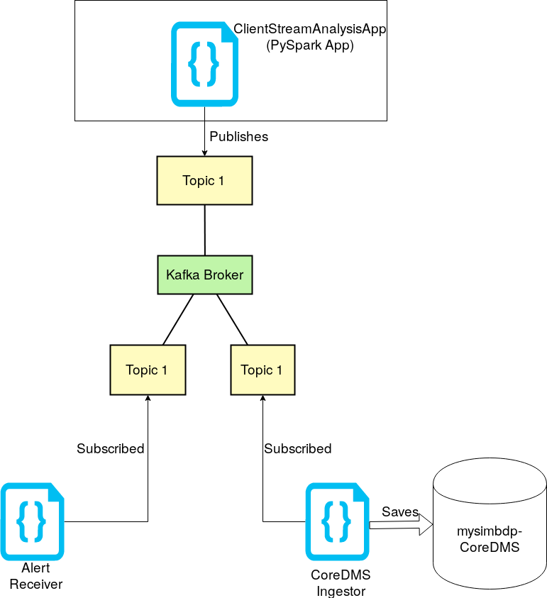
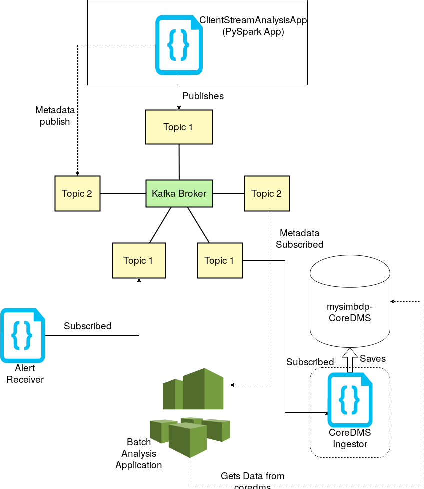

# Assignment report 3

### CS-E4640 Big data platforms 
#### Rohit Raj ([rohit.raj@aalto.fi](mailto:rohit.raj@aalto.fi)) - 801636
---
## Part 1
###  Design for streaming analytics 

 
1. The dataset used for streaming analytics was the `Indoor Localization Dataset`. The dataset contains information concerning the older people’s movement inside their homes regarding their indoor location in the home setting [1]. This is a time-series data and hence, suitable for streaming analysis and provide real-time time-sensitive updates. 

The dataset contains 4 fields, `part_id`, `ts_date`, `ts_time` and `room`. The fields `ts_date` and `ts_time` gives us the exact timestamp and the field `room` gives us the location where the person entered at that time. According to the dataset providers, it is assumed that the person remained in the same room till the next recoding data.

The two different analytics that a person can do is :
* __Streaming analytics__: The streaming analytics in this type of dataset is very important. The streaming analytics will give us intermediate reports of the person's location. We can run streaming analysis on a tumbling window of a fixed duration where we measure the person's location and flag (and alarm) any suspicion. For example: If an elderly spends more than one hour in kitchen, we can send and alarm to the emergency/health services as it is abnormal to be in kitchen for more than one hour. We can define different threshold for different rooms such as 12 hour for bedroom etc. Hence, a timely report from streaming analytics is necessary. 

* __Batch Analytics__: Batch analytics in this case could run on the result produced in the from the stream analytics. This type of analysis will run on certain fixed intervals (once a day or once a week) and will help us in determining the general trend of an elderly person's health behaviour. We can think of the result from the stream analysis as an input to this batch analysis.  

Therefore, the two broad analysis objectives for this dataset would be `Immediate health monitoring` (Done by streaming analytics) and `long term health monitoring` (Done by batch analysis).

2. The analytics should handle `non-keyed` data-stream in this case. We have seen that the data is linear and contains only one type of information for every user. `Keyed` data streams are useful where one type of producer gives different types of consumer data (And each may require different type of stream processing). Since, our dataset only contains location and timestamp of a user, we need everything to be processed on a single stream-analytics application.

The delivery guarantee for our data should ideally be `exactly-once`. Our stream-analytics is responsible for monitoring the health of elderly using their room movement. A loss of data (even a single message) could trigger a false alarm with the health services. (For example a missed message would lead to the stream-analytics app decide that this elder person hasn't moved from kitchen in 1 hour). Hence, it is extremely imperative that there is no loss of messages. A duplication of data can also lead to wrong analysis that this user has in-fact moved twice in one hour, where as in reality he hasn't. So a potential health hazard would not be flagged by our stream analysis app in this case.

3. `Event Time` i.e. the time at which the incident took place should be associated with the stream sources. The analytics for our dataset is basically driven with the time-series location of people's data. The event timestamp helps us calculate both the `stream` analytics and `batch` analytics. Hence, from the analytics result point of view, it is important our results correspond with the  event time. If the event timestamp if not available for this data, we can perhaps add the `Ingestion time` i.e. time when the values were received by the broker; to the data. The results might not be as accurate as event time, but we will still be able to perform the analytics.

`Windowing`: We will require a fixed size tumbling window. Since, we are developing a health monitor, our stream analytics application will run at a fixed interval (i.e. one hour) and check for the location update of the user. If there is no update in one hour window, depending on the past location of the user, we will have to notify the health services. Hence, it is important that there is no gap in between windows.

4. Our analytics application is for health services and providing immediate assistance to the elderly people. The most important performance metric is undoubtedly the latency. The analytics should be able to provide the output(alert) as quickly as possible as to notify the appropriate agency. A low latency in this case could very possibly save a life. Throughput is also an important performance metric though it is not as important as the latency. We should be able to manage more number of users using the same analytics application and be able to notify the agency. However, for our use case, a low latency result remains the prime goal of our application. 

5. The design of our architecture has been displayed below:

* Fig 1: Overview of our analytics platform system

The various components are: 
* The Data sources: They publish the information to `mosquitto` broker on regular interval. There can be multiple independent data streams publishing on same topic. 
* __mysimbdp__ Message Broker: The message broker is `Kafka` and is reused from previous assignment (Assignment #1). Kafka provides partitioned message stream broker and due to its scalability, it makes perfect choice for integration with stream processing applications. The variant of Kafka used was `confluent-kafka`'s docker compose image. It runs TCP connections on port 9092 and Zookeeper service discovery at `2181`. It allows automatic topic creation whenever a publisher or subscriber gets attached to the broker. 

* __mysimbdp__ Streaming computing service: This service runs Apache Spark Streaming and serves as the platform for running client streaming analytics application. It also aids in consumption of incoming stream data. In addition we have also integrated key value store like Redis that help streaming analysis applications (discussed in details in the later section).

* Customer streaming analytics app: This application is responsible for consuming stream data, performing streaming analytics on a fixed window and then publish the result. It does the consumption on same kafka topics that the consumer is producing on. It publishes the stream results on a different topic that clients can ingest onto. Additionally it may also connect to a temporary database like Redis for performing stateful streaming analysis (Shown in Fig 1).



* Fig 2: Sample Result of Streaming application received over Kafka


* Consumer (Console): The end-user consumes the analytics result(alerts) from the Kafka message broker. It remains subscribed to the topic that our `Customer streaming analytics app` publishes results on. 

* `Ingestion Application` and `mysimbdp-coredms`: These are the preexisting platforms from our previous projects that also listen to the stream analysis results on the broker. The Ingestion Application saves the result into the coredms (MongoDB) and this result can be used to perform batch analysis later on.   

---

## Part 2
###  Implementation of streaming analytics 

1. `customerstreamapp` is developed on python using the `pySpark` package for spark on python. The stream messages are sent as comma separated value to the topic `mysimbdp` on our kafka broker. pySpark streaming supports out of the box connection to Kafka using the `pyspark.streaming.kafka` module. It collates all the streaming result into a RDD which is processed on a fixed tumbling window interval. All of the spark streaming functions and methods work on a RDD. The Kafka messages are automatically deserialized as `Key-Value` pair of strings by the pyspark package. Hence we need to do ```directKafkaStream.map(lambda x: x[1])``` to get the values (`x[1]` is the value of the Kafka message). After receiving message as string, we can perform the `.split()` to get the list of values (`part_id`, `ts_date`, `ts_time` and `room`) and we can perform operation on them.

2. The `process` method does the processing of the incoming kafka messages. In our implementation, `Redis` is being used as temporary store of data. It stores `key-value` pair of information where `key` is the `userId` and `value` is the last known time and location for this userId. So when we receive a user message, we fetch the user's last known location and time and the send an alert if the user hasn't changed the room in certain time period. The pseudo-code for `clientStreamApp`is as follows:

```python
1. for each message m in RDD:
2.      Split the m to list.
3.      Get current_location, current_timestamp from this list
4.      if userId does not exists in Redis:
5.          Insert the values (current_location, current_timestamp) into Redis with UserId as Key.
6.          break
7.      else if UserId exists in Redis:
8.          Get the last known timestamp and location for this userId
9.          if last_location = current_location and last_timestamp-current_timestamp is more than the threshold
10.             SEND ALERT()
11.             break
12.         else:
13.             Update the current_location and current_timestamp in the redis for this user.
14.             break
```

We are sending the alert on a different topic `mysimbdp-clientReport` using the same Kafka broker. In the pseudo-code we have a threshold of time before we send the alert. For example: if the last_location is kitchen and the gap is more than 1 hour, we send the alert. Similar thresholds have been defined for every different room. 

The pseudo-code should run over every message of the RDD in the DStream. Hence, we have used  `.map()` for iterating over the message, and `.foreachRDD()` for iterating over every DStream. The `map` method expects a function where we supply our `process()` method.  


3. The client stream application was submitted to the `Spark` platform using the following command:

```
spark-submit --packages  org.apache.spark:spark-streaming-kafka-0-8-assembly_2.11:2.4.4 ../customerstreamapp/customerstreamapp.py
```

Notice we need to specify the `spark-streaming-kafka-0-8-assembly` that Spark automatically fetches from the online Maven repository on the first attempt. Spark has it's dashboard that runs on port `4040`. We collected the statistics from this dashboard.

For testing purposes the window size of 30 mins was moved to only 30 seconds and the messages were being sent to the broker and stream app every 5 seconds. 


* Fig 3: Spark Stream Ingestion statistics

We can see that the batches were of 30 seconds each and the ingestion rate was 0.2 record/per second.


* Fig 4: Spark Job processing times

We can see from the figure above, that the job processing time was 2 seconds for the first batch and ~0.8-0.9 sec every subsequent batches. Since we are using in-memory database Redis, for fetching the value, the `get` value operation is super-quick and is not an bottleneck to the stream processing application. 


* Fig 5: Spark Executors

Also the executors were taking 384MB of RAM while running the stream analysis, which is not very high for a stream processing operation.

The results are published into the kafka broker on different topic.
 
4. Error handling in our code is done in two ways to ensure maximum availability of our stream processing application.
* In case of wrong formatting, or absence of time data in the message stream, we use the current time (`datetime.now`) to process the analysis i.e. we switch from event-time to processing time. This is done under the motivation that our broker provides the data in near-realtime speeds and we can still derive meaningful results from processing time. To check the error rate, in this case, we used some wrong formatting of the date.

* In case, we are not able to handle the error, we log the stack-trace in the file and continue with the execution. We do this to provide maximum stream processing without shutting down the clientStreamApplication in case of unexpected input.

5. Spark allows us to parallelize number of streams when taking input from kafka. We can choose the level of parallelism by creating multiple `DirectKafkaStream` and then unifying them by using Spark's `streaming_context.union()` function [2]. We tested using 3 direct streams :


* Fig 6: 3 Direct Streams used for processing job

There wasn't much performance change, in the processing time:


* Fig 7: Processing time for 3 parallelism stream

It went up from 0.9sec per batch for one degree of parallelism to 2 sec per batch on average on 3 degree of parallelism. 

Another level of parallelism Spark allows us to control is the number of parallel tasks in the data processing. It is sent as an argument in the configuration property [3]. Specifying `local[*]` in this property means maximum number of available cores will be detected and automatically used for processing. We have used this option throughout our data processing tests. Hence, our data was being processed on multiple threads automatically.

---

# Part 3
## Connection

1. To store the results of analytics into `mysimbdp-coredms`, we will subscribe to the same topic that the consumer is subscribed to. This essentially means that when ever the alert is sent to the consumer, a copy of alert is delivered to our final ingestor app that will feed the data into the mysimbdp-coredms. To do this we need to ensure that the `consumer` and `coredms` are subscribed to same topic but belong to different consumer groups of Kafka. (If the belong to same consumer group, only one copy of message will be delivered to either consumer or coredms). 

We illustrate this mechanism in the picture below:


* Fig 8: Saving into mysimbdp-coredms

We can see that both the CoreDms Ingestor and Alert Receiver are subscribed to the same topic.

2. A sample batch analysis application could be a Machine-Learning Analytics application that runs `Apache Spark MLlibs`. The machine learning application would try to build models and predictions on the health of an elderly person. These types of streaming analysis information could be extremely effective in creating sustainable machine learning models. For example: a sample ML model could predict that people suffering early-grade dementia tend to spend more time in `kitchen` than others. 
The platform for implementation  would still be Apache Spark and we can use `spark-submit` to submit MLlibs jobs to the batch processing application. The implementation for such a batch processing application could use a window of few days to ensure that we have collated handful of alerts. 

3. To dynamically/intelligently call batch analysis application, we will have to create batch analysis application tool, that will read the metadata of the stream analysis application. This metadata will be relayed via a new topic on Kafka broker and will contain information like frequency of alert, timings of these alerts etc.


* Fig 9: Intelligent Batch analysis application

We can see in the figure above, that the Batch Analysis application is listening on `Topic 2` which is being used for metadata transfer. Based on the metadata, we can define a threshold above which we should trigger the Batch Analysis. The batch analysis will then fetch the saved data from coredms and perform the batch Machine learning job.

4. 


---
### References

[1] Ellul J, Polycarpou M, Kotsani M; Indoor Localization Dataset; May 7, 2019;  Available at: https://zenodo.org/record/2671590#.XXJahPxRUlU

[2] https://spark.apache.org/docs/2.2.0/streaming-programming-guide.html#level-of-parallelism-in-data-receiving

[3] https://spark.apache.org/docs/2.2.0/streaming-programming-guide.html#level-of-parallelism-in-data-processing