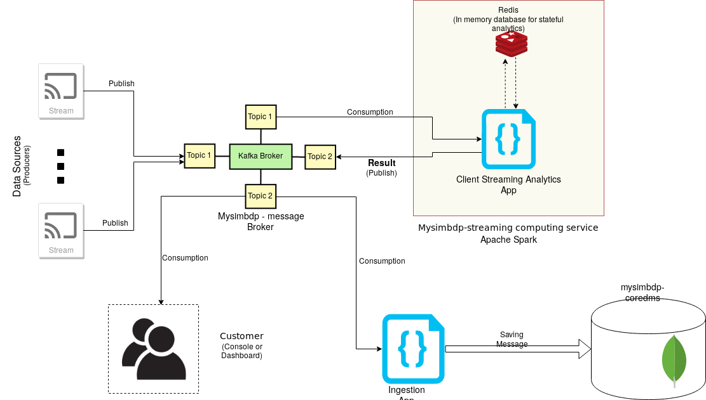

# Assignment report 3

### CS-E4640 Big data platforms 
#### Rohit Raj ([rohit.raj@aalto.fi](mailto:rohit.raj@aalto.fi)) - 801636
---
## Part 1
###  Design for streaming analytics 

 
1. The dataset used for streaming analytics was the `Indoor Localization Dataset`. The dataset contains information concerning the older people’s movement inside their homes regarding their indoor location in the home setting [1]. This is a time-series data and hence, suitable for streaming analysis and provide real-time time-sensitive updates. 

The dataset contains 4 fields, `part_id`, `ts_date`, `ts_time` and `room`. The fields `ts_date` and `ts_time` gives us the exact timestamp and the field `room` gives us the location where the person entered at that time. According to the dataset providers, it is assumed that the person remained in the same room till the next recoding data.

The two different analytics that a person can do is :
* __Streaming analytics__: The streaming analytics in this type of dataset is very important. The streaming analytics will give us intermediate reports of the person's location. We can run streaming analysis on a tumbling window of a fixed duration where we measure the person's location and flag (and alarm) any suspicion. For example: If an elderly spends more than one hour in kitchen, we can send and alarm to the emergency/health services as it is abnormal to be in kitchen for more than one hour. We can define different threshold for different rooms such as 12 hour for bedroom etc. Hence, a timely report from streaming analytics is necessary. 

* __Batch Analytics__: Batch analytics in this case could run on the result produced in the from the stream analytics. This type of analysis will run on certain fixed intervals (once a day or once a week) and will help us in determining the general trend of an elderly person's health behaviour. We can think of the result from the stream analysis as an input to this batch analysis.  

Therefore, the two broad analysis objectives for this dataset would be `Immediate health monitoring` (Done by streaming analytics) and `long term health monitoring` (Done by batch analysis).

2. The analytics should handle `non-keyed` data-stream in this case. Since, we have seen that the data is linear and contains only one type of information for every user. `Keyed` data streams are useful where one type of producer gives different types of consumer data (And each my require different type of stream processing). Since, our dataset only contains location and timestamp of a user, we need everything to be processed on a single stream-analytics application.

The delivery guarantee for our data should ideally be `exactly-once`. Our stream-analytics is responsible for monitoring the health of elderly using their room movement. A loss of data (even a single message) would trigger a false alarm with the health services. (For example a missed message would lead to the stream-analytics app decide that this elder person hasn't moved from kitchen in 1 hour). Hence, it is extremely imperative that there is no loss of messages. A duplication of data can also lead to wrong analysis that this user has in-fact moved twice in one hour, where as in reality he hasn't. So a potential health hazard would not be flagged by our stream analysis app in this case.

3. `Event Time` should be associated with the stream sources. The analytics for our dataset is basically driven with the time-series location of people's data. The event timestamp helps us calculate both the `stream` analytics and `batch` analytics. Hence, from the analytics result point of view, it is important our results correspond with the  event time. If the event timestamp if not available for this data, we can perhaps add the `Ingestion time` i.e. time when the values were received by the broker; to the data. The results might not be as accurate as event time, but we will still be able to perform the analytics.

`Windowing`: We will require a fixed size tumbling window. Since, we are developing a health monitor, our stream analytics application will run at a fixed interval (i.e. one hour) and check for the location update of the user. If there is no update in one hour window, depending on the past location of the user, we will have to notify the health services. Hence, it is important that there is no gap in between windows.

4. Our analytics application is for health services and providing immediate assistance to the elderly people. The most important performance metric is undoubtedly the latency. The analytics should be able to provide the output(alert) as quickly as possible as to notify the appropriate agency. A low latency in this case could very possibly save a life. Throughput is also an important performance metric though it is not as important as the latency. We should be able to manage more number of users using the same analytics application and be able to notify the agency. However, for our use case, a low latency result remains the prime goal of our application. 

5. The design of our architecture has been displayed below:

* Fig 1: Overview of our analytics platform system

The various components are: 
* The Data sources: They publish the information to `mosquitto` broker on regular interval. There can be multiple independent data streams publishing on same topic. 
* __mysimbdp__ Message Broker: The message broker is lightweight `Mosquitto` and is reused from previous assignment. The variant of Mosquitto used was `eclipse-mosquitto`'s docker image. It runs TCP connections on port 1883 and websocket on port 9000. It allows automatic topic creation whenever a publisher or subscriber got attached to the broker. 

* __mysimbdp__ Streaming computing service: This service runs Apache Spark and serves as the platform for running client streaming analytics application. It also aids in consumption of incoming stream data. It also has integrated tools like Redis that help streaming analysis applications.

* Customer streaming analytics app: This application is responsible for consuming stream data, performing streaming analytics on a fixed window and then publish the result. It does the consumption on same MQTT topics that the consumer is producing on. It publishes the stream results on a different topic that clients can ingest onto. Additionally it may also connect to a temporary database like Redis for performing stateful streaming analysis (Shown in Fig 1).

* Consumer (Console): The end-user consumes the analytics result(alerts) from the MQTT message broker. It remains subscribed to the topic that our `Customer streaming analytics app` publishes results on. 

* `Ingestion Application` and `mysimbdp-coredms`: These are the preexisting platforms from our previous projects that also listen to the stream analysis results on the broker. The Ingestion Application saves the result into the coredms (MongoDB) and this result can be used to perform batch analysis later on.   

---
### References

[1] Ellul J, Polycarpou M, Kotsani M; Indoor Localization Dataset; May 7, 2019;  Available at: https://zenodo.org/record/2671590#.XXJahPxRUlU